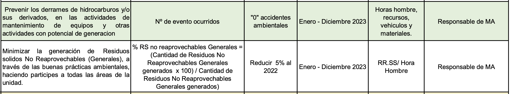

# 6.2 ⚠️ Objetivos del SIG y planificación para lograrlos

## Objetivos

  - 🟠 [FOR-SIG-007 Objetivos SIG SSOMAC - CALIDAD 2023](https://gmiperu.sharepoint.com/:x:/r/sites/ESTRUCTURASIGGMI/Documentos%20compartidos/ESTRUCTURA%20SIG%20GMI/9.1%20SEGUIMIENTO,MEDICION%20Y%20ANALISIS/3.%20Registros/7.%20Objetivos%20de%20Calidad/2023/3.%20FOR-SIG-007%20Objetivos%20SIG%20SSOMAC%20-%20CALIDAD%202023.xlsx?d=w0716de9f7fcb426eac4e841a026cfa28&csf=1&web=1&e=Vc4uOc)
  > Alinear los objetivos con RRHH y Mantenimiento
  - [Seguimiento Objetivos Ambientales-GMI-2023](https://gmiperu.sharepoint.com/:x:/r/sites/ESTRUCTURASIGGMI/Documentos%20compartidos/ESTRUCTURA%20SIG%20GMI/9.1%20SEGUIMIENTO,MEDICION%20Y%20ANALISIS/3.%20Registros/6.%20Objetivos%20Ambientales/6.%20OBJ%20SGA%202023/Seguimiento%20Objetivos%20Ambientales-GMI-2023.xlsx?d=w21af9c89c72e4a708f02d67fadf41390&csf=1&web=1&e=Cfv5Yk)
  > Los objetivos mencionados en el panel informativos no estan alineados a los del seguimiento
  > 
  - 🟠 [FOR-SIG-007 Objetivos SIG SSOMAC - SSO 2023](https://gmiperu.sharepoint.com/:x:/r/sites/ESTRUCTURASIGGMI/Documentos%20compartidos/ESTRUCTURA%20SIG%20GMI/6.2%20OBJETIVOS%20DEL%20SIG%20Y%20PLANIFICACI%C3%93N%20PARA%20LOGRARLOS/3.%20Registros/4.%20Objetivos/2023/1.%20Objetivos%20de%20SSO/1.%20FOR-SIG-007%20Objetivos%20SIG%20SSOMAC%20-%20SSO%202023.xlsx?d=weed03738d99e43368533ebd450631768&csf=1&web=1&e=LTNlH7)

  > Alinear los objetivos de SSO con evidencias

[PLAN ANUAL DE SALUD OCUPACIONAL - GMI 2023](https://gmiperu.sharepoint.com/:b:/r/sites/ESTRUCTURASIGGMI/Documentos%20compartidos/ESTRUCTURA%20SIG%20GMI/6.2%20OBJETIVOS%20DEL%20SIG%20Y%20PLANIFICACI%C3%93N%20PARA%20LOGRARLOS/3.%20Registros/7.%20Programa%20de%20SO/2023/PLAN%20ANUAL%20DE%20SALUD%20OCUPACIONAL%20-%20GMI%202023.pdf?csf=1&web=1&e=zRHH1x)

## Plan SSOMA
  - [PLAN ANUAL DE SALUD OCUPACIONAL - GMI 2023](https://gmiperu.sharepoint.com/:b:/r/sites/ESTRUCTURASIGGMI/Documentos%20compartidos/ESTRUCTURA%20SIG%20GMI/6.2%20OBJETIVOS%20DEL%20SIG%20Y%20PLANIFICACI%C3%93N%20PARA%20LOGRARLOS/3.%20Registros/2.%20Plan%20SSOMA/2023/2.%20Aprobados/PLAN%20ANUAL%20DE%20SALUD%20OCUPACIONAL%20-%20GMI%202023.pdf?csf=1&web=1&e=VqxLRL)
  :::danger Programas de SO
  Hay Planes que no se estan cumpliendo dentro del programa
  :::
  - [PLA-SSO-001 Plan Anual SSOT - 2023](https://gmiperu.sharepoint.com/:b:/r/sites/ESTRUCTURASIGGMI/Documentos%20compartidos/ESTRUCTURA%20SIG%20GMI/6.2%20OBJETIVOS%20DEL%20SIG%20Y%20PLANIFICACI%C3%93N%20PARA%20LOGRARLOS/3.%20Registros/2.%20Plan%20SSOMA/2023/2.%20Aprobados/PLA-SSO-001%20Plan%20Anual%20SSOT%20-2023.pdf?csf=1&web=1&e=YsBNlj)
  - [Plan de Manejo Ambiental-GMI-2023](https://gmiperu.sharepoint.com/:b:/r/sites/ESTRUCTURASIGGMI/Documentos%20compartidos/ESTRUCTURA%20SIG%20GMI/6.2%20OBJETIVOS%20DEL%20SIG%20Y%20PLANIFICACI%C3%93N%20PARA%20LOGRARLOS/3.%20Registros/2.%20Plan%20SSOMA/2023/2.%20Aprobados/Plan%20de%20Manejo%20Ambiental-GMI-2023.pdf?csf=1&web=1&e=Kzkg4c)
  - [PLA-SSO-007 Plan de Prevención Fatiga y Somnolencia_](https://gmiperu.sharepoint.com/:b:/r/sites/ESTRUCTURASIGGMI/Documentos%20compartidos/ESTRUCTURA%20SIG%20GMI/6.2%20OBJETIVOS%20DEL%20SIG%20Y%20PLANIFICACI%C3%93N%20PARA%20LOGRARLOS/3.%20Registros/2.%20Plan%20SSOMA/2023/2.%20Aprobados/PLA-SSO-007%20Plan%20de%20Prevenci%C3%B3n%20Fatiga%20y%20Somnolencia_.pdf?csf=1&web=1&e=dkX8bQ)
  - Plan de Respuesta ante emergencias GMI 2023 F

## RITRA
  - RITRA GMI v.01 2023
  - Alpayana RITRA 2023

## Plan Anual de Capacitaciones 2023

:::caution Medicion del desempeño de las capacitaciones
Como miden la eficacia

:::

  - [PLA-SSO-003 Plan Anual de Capacitación 2023_](https://gmiperu.sharepoint.com/:b:/r/sites/ESTRUCTURASIGGMI/Documentos%20compartidos/ESTRUCTURA%20SIG%20GMI/6.2%20OBJETIVOS%20DEL%20SIG%20Y%20PLANIFICACI%C3%93N%20PARA%20LOGRARLOS/3.%20Registros/2.%20Plan%20SSOMA/2023/2.%20Aprobados/PLA-SSO-003%20Plan%20Anual%20de%20Capacitaci%C3%B3n%202023_.pdf?csf=1&web=1&e=2XfTDg)
  - [Programa Anual de Capacitaciones 2023 Gestión Minera Integral SAC](https://gmiperu.sharepoint.com/:b:/r/sites/ESTRUCTURASIGGMI/Documentos%20compartidos/ESTRUCTURA%20SIG%20GMI/6.2%20OBJETIVOS%20DEL%20SIG%20Y%20PLANIFICACI%C3%93N%20PARA%20LOGRARLOS/3.%20Registros/2.%20Plan%20SSOMA/2023/2.%20Aprobados/Programa%20Anual%20de%20Capacitaciones%202023%20Gesti%C3%B3n%20Minera%20Integral%20SAC.pdf?csf=1&web=1&e=2kmsut)

## Formatos
  - FOR-SSO-123 Presupuesto Anual SSOMAC
  - PLA-XXX-00X Plan Anual de XXXXXX 202X RV.XX

:::tip
 El diagnostico de linea base debe de evidenciarse de preferencia
:::

  - PRG-SSO-003 Programa Anual de Simulacros

## Registros

### 0. Programas PASSO
:::danger
Solo se encuentra del 2022
:::
  - FOR-SSO-123 Presupuesto Anual SSOMAC
  - PRG-SSO-003 Programa Anual de Simulacros 2022

:::danger
- Normativa donde menciona los simulacros minimos
- Cuando se modifica el programa anual de capacitaciones de la brigada, debe revisarse con el comite?, como procede los cambios?, debe entregarse certificados?, debe ser externo o puede ser interno?
:::

  - Programa anual de Inspecciones

### 1. Plan PASSO - Anexos
  - 1. Plan Anual SSOT -2023
  - Anexo 01-IPERC LB Seguridad (25-11)
  - Anexo 2 - Programa de actividades 2023
  - Anexo 3 - Programa Anual de Capacitaciones 2023
  - Anexo 4 - Programa Anual de Monitoreos

:::caution
- programa de monitoreo, puede reailzarse desde marzo, si no se realizo como lo subsano?, puede o debe realizarlo el higienista del titular?, puede firmarlo el ing de seguridad?, puede ser un bachiller quien firma?, debo evidenciar la calibración de los equipos de medición?, como respondo ante una auditoria?
- La calibracion de los draguer, es anual, o tengo que evidenciar su verificación para mandar los que tengan desvios?
:::

  - Anexo 5 - Presupuesto Anual 2023
  - Anexo 6 - Matriz de Registro de Operadores y Conductores

:::caution
- El registro de operadores y conductores, en la ley muestra requisitos, en la norma ISO, tambien menciona sobre el seguimiento al status sobre este punto?
:::
  - Anexo 7  Programa anual de Simulacros
  - Anexo 8  Programa anual de Inspecciones
  - Anexo 9  Programa anual de Inspecciones de EPPS
  - Anexo 10 Codigo de colores
  - GMISAC RITRA x revisión

#### 1. Cargos de Autoridades
  - CARGO DE OSINERGMIN
  - CARGO DE SUNAFIL
  - CARGO VIRTUAL OSINERGMIN
  - CARTA Nº 002 OSINERGMIN - 2023
  - CARTA Nº 002 SUNAFIL 2023
  - REGISTRO OSINERGMIN Nº 002- 2023

:::caution
- Sobre las auditorias de osinergmin, el auditor de ISO, me puede pedir evidencias de los cierres?, que pasa si le digo que no se realizo auditorias de osinergmin? o que si estos estan en lima?
:::

### 3. Programas SIG

:::caution
vacio
:::

### 3. Programas SIG SSOMAC

:::caution
Solo hay 2022:
- PRG-SIG-003 Programa de Evaluación de Contratistas SIG
:::

### 4. Objetivos

  0. Cartillas
  1. Objetivos de SSO
      1. [FOR-SIG-007 Objetivos SIG SSOMAC - SSO 2023](https://gmiperu.sharepoint.com/:x:/r/sites/ESTRUCTURASIGGMI/Documentos%20compartidos/ESTRUCTURA%20SIG%20GMI/6.2%20OBJETIVOS%20DEL%20SIG%20Y%20PLANIFICACI%C3%93N%20PARA%20LOGRARLOS/3.%20Registros/4.%20Objetivos/2023/4.%20Resumen%20de%20Objetivos%20SIG%20SSOMAC%20GMI%202022/0.%20FOR-SIG-007%20Objetivos%20SIG%20SSOMAC%202023_GMI.xlsx?d=w8d1d06a8d61e490a9b4e6c1d8c1cebb8&csf=1&web=1&e=bJAoze)

:::danger
- Sobre los objetivos, en el FOR-SIG-007 Objetivos de SIG menciona varios objetivos, y en el Plan Anual menciona pocos objetivos, como se podria solucionar

:::

    * 9. Evaluación Medica - EMO
      - INFORME Nº001-2023-RR.HH GMI
      - Relacion de Personal con Suficiencia Medica para TRABAJO EN ALTURA (1.80MTS) - ENE 2023
  - 2. Objetivos de MA
    * Objetivos Ambientales-GMI-2023
  - 3. Objetivos del SIG - CALIDAD
    * 3. FOR-SIG-007 Objetivos SIG SSOMAC - CALIDAD 2023
  - 4. Resumen de Objetivos SIG SSOMAC GMI 2022
    * 0. FOR-SIG-007 Objetivos SIG SSOMAC 2023_GMI
    * 0. FOR-SIG-007 Objetivos SIG SSOMAC 2023_GMI
    * 0. FOR-SIG-007 Objetivos SIG SSOMAC 2023_GMI
    * Alpayana
      * FOR-SIG-007 Objetivos SIG SSOMA 2023_GMI
      * FOR-SIG-007 Objetivos SIG SSOMA 2023_GMI
  - 5. Plan de PVPC Covid 19

:::caution
- Que se necesita, sobre el plan covid?, que debo presentar?, debe reflejarse la DA 339 en el plan de Salud Ocupacional o solo en el Plan covid?
- Los Plan Anual de riesgos psicosociales?, que debe contener?
:::

  - 6. Plan de Respuesta ante emergencias
  - 7. Programa de SO
